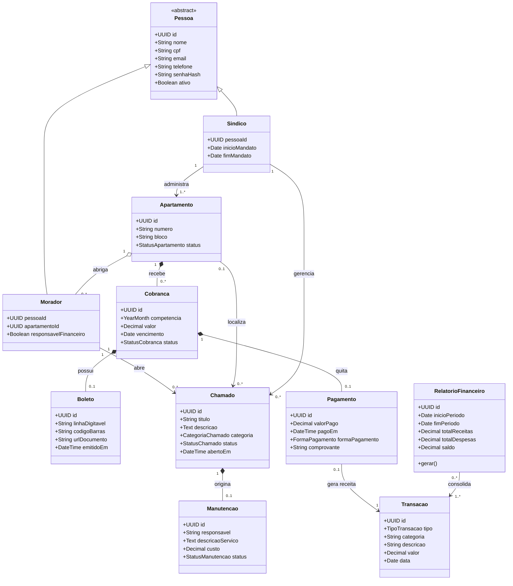

# S1-03 - Modelo de entidades e relacionamentos

Este documento define o modelo de domínio inicial do **LBF Condomínio**. O escopo considera um condomínio por instalação do sistema.

## 1. Entidades

### 1.1 Pessoa

Entidade abstrata que reúne os dados comuns de síndicos e moradores.

| Atributo | Tipo | Regra |
| -------- | ---- | ----- |
| `id` | UUID | Identificador único e imutável. |
| `nome` | String | Obrigatório. |
| `cpf` | String | Obrigatório e único. Deve ser armazenado sem formatação. |
| `email` | String | Obrigatório, válido e único. |
| `telefone` | String | Dado de contato atualizável. |
| `senhaHash` | String | Obrigatório. A senha nunca deve ser armazenada em texto puro. |
| `ativo` | Boolean | Define se a pessoa pode acessar o sistema. |
| `criadoEm` | DateTime | Data e hora do cadastro. |
| `atualizadoEm` | DateTime | Data e hora da última alteração. |

### 1.2 Síndico

Especialização de `Pessoa` responsável pela administração do sistema.

| Atributo | Tipo | Regra |
| -------- | ---- | ----- |
| `pessoaId` | UUID | Chave primária e estrangeira para `Pessoa`. |
| `inicioMandato` | Date | Obrigatório. |
| `fimMandato` | Date | Opcional enquanto o mandato estiver ativo. |

### 1.3 Morador

Especialização de `Pessoa` vinculada a um apartamento.

| Atributo | Tipo | Regra |
| -------- | ---- | ----- |
| `pessoaId` | UUID | Chave primária e estrangeira para `Pessoa`. |
| `apartamentoId` | UUID | Chave estrangeira obrigatória para `Apartamento`. |
| `responsavelFinanceiro` | Boolean | Indica quem responde pelas cobranças da unidade. |

### 1.4 Apartamento

Representa uma unidade habitacional do condomínio.

| Atributo | Tipo | Regra |
| -------- | ---- | ----- |
| `id` | UUID | Identificador único e imutável. |
| `numero` | String | Obrigatório. |
| `bloco` | String | Opcional quando o condomínio não possuir blocos. |
| `status` | Enum | `ATIVO` ou `INATIVO`. |

A combinação entre `bloco` e `numero` deve ser única.

### 1.5 Cobrança

Representa a obrigação financeira mensal de um apartamento.

| Atributo | Tipo | Regra |
| -------- | ---- | ----- |
| `id` | UUID | Identificador único e imutável. |
| `apartamentoId` | UUID | Chave estrangeira obrigatória para `Apartamento`. |
| `competencia` | YearMonth | Mês e ano de referência. |
| `valor` | Decimal | Obrigatório e maior que zero. |
| `vencimento` | Date | Obrigatório. |
| `status` | Enum | `PENDENTE`, `PAGA`, `VENCIDA` ou `CANCELADA`. |
| `criadaEm` | DateTime | Data e hora da geração. |

Um apartamento não pode possuir duas cobranças ativas para a mesma competência.

### 1.6 Boleto

Documento opcional emitido para pagamento de uma cobrança.

| Atributo | Tipo | Regra |
| -------- | ---- | ----- |
| `id` | UUID | Identificador único e imutável. |
| `cobrancaId` | UUID | Chave estrangeira obrigatória e única para `Cobrança`. |
| `linhaDigitavel` | String | Obrigatória e única. |
| `codigoBarras` | String | Obrigatório e único. |
| `urlDocumento` | String | Endereço seguro para visualização ou download. |
| `emitidoEm` | DateTime | Data e hora da emissão. |

### 1.7 Pagamento

Representa a quitação de uma cobrança.

| Atributo | Tipo | Regra |
| -------- | ---- | ----- |
| `id` | UUID | Identificador único e imutável. |
| `cobrancaId` | UUID | Chave estrangeira obrigatória e única para `Cobrança`. |
| `valorPago` | Decimal | Obrigatório e maior que zero. |
| `pagoEm` | DateTime | Data e hora do pagamento. |
| `formaPagamento` | Enum | Meio utilizado para o pagamento. |
| `comprovante` | String | Identificador ou endereço do comprovante. |

O MVP considera pagamento integral e único por cobrança. Pagamentos parciais exigirão a revisão da cardinalidade para `Cobrança 1:N Pagamento`.

### 1.8 Chamado

Também denominado ocorrência, representa uma solicitação registrada por um morador.

| Atributo | Tipo | Regra |
| -------- | ---- | ----- |
| `id` | UUID | Identificador único e imutável. |
| `moradorId` | UUID | Chave estrangeira obrigatória para `Morador`. |
| `apartamentoId` | UUID | Opcional para ocorrências em áreas comuns. |
| `titulo` | String | Obrigatório. |
| `descricao` | Text | Obrigatória. |
| `categoria` | Enum | Categoria do problema informado. |
| `status` | Enum | `ABERTO`, `EM_ATENDIMENTO`, `CONCLUIDO` ou `CANCELADO`. |
| `abertoEm` | DateTime | Data e hora de abertura. |
| `atualizadoEm` | DateTime | Data e hora da última atualização. |

Todo chamado deve ser criado com o status `ABERTO`.

### 1.9 Manutenção

Representa o atendimento operacional originado por um chamado.

| Atributo | Tipo | Regra |
| -------- | ---- | ----- |
| `id` | UUID | Identificador único e imutável. |
| `chamadoId` | UUID | Chave estrangeira obrigatória e única para `Chamado`. |
| `responsavel` | String | Pessoa ou empresa responsável pelo atendimento. |
| `descricaoServico` | Text | Serviço planejado ou executado. |
| `custo` | Decimal | Valor da manutenção, quando aplicável. |
| `inicioEm` | DateTime | Início do atendimento. |
| `conclusaoEm` | DateTime | Opcional até a conclusão. |
| `status` | Enum | `PLANEJADA`, `EM_EXECUCAO`, `CONCLUIDA` ou `CANCELADA`. |

### 1.10 Transação

Representa uma movimentação no controle financeiro.

| Atributo | Tipo | Regra |
| -------- | ---- | ----- |
| `id` | UUID | Identificador único e imutável. |
| `pagamentoId` | UUID | Opcional e único quando a receita for originada por pagamento. |
| `tipo` | Enum | `RECEITA` ou `DESPESA`. |
| `categoria` | String | Classificação financeira. |
| `descricao` | String | Obrigatória. |
| `valor` | Decimal | Obrigatório e maior que zero. |
| `data` | Date | Data de competência da movimentação. |
| `criadaEm` | DateTime | Data e hora do registro. |

Um pagamento confirmado deve gerar uma transação de receita. Despesas podem ser registradas diretamente, sem pagamento associado.

### 1.11 Relatório Financeiro

Projeção de leitura gerada a partir das transações de um período. Não altera os lançamentos que consolida.

| Atributo | Tipo | Regra |
| -------- | ---- | ----- |
| `id` | UUID | Identificador da geração, caso o relatório seja persistido. |
| `inicioPeriodo` | Date | Data inicial obrigatória. |
| `fimPeriodo` | Date | Data final obrigatória e igual ou posterior à inicial. |
| `totalReceitas` | Decimal | Soma das receitas do período. |
| `totalDespesas` | Decimal | Soma das despesas do período. |
| `saldo` | Decimal | Diferença entre receitas e despesas. |
| `geradoEm` | DateTime | Data e hora da geração. |

## 2. Diagrama de classes

## 3. Revisão dos relacionamentos e cardinalidades

| Origem | Relacionamento | Destino | Cardinalidade | Justificativa |
| ------ | -------------- | ------- | ------------- | ------------- |
| Pessoa | Herança | Síndico | `1:0..1` | Um registro de pessoa pode exercer o papel de síndico. |
| Pessoa | Herança | Morador | `1:0..1` | Um registro de pessoa pode exercer o papel de morador. |
| Síndico | Administra | Apartamento | `1:1..N` | No escopo de condomínio único, um síndico administra uma ou mais unidades. |
| Apartamento | Abriga | Morador | `1:0..N` | Uma unidade pode estar vazia ou possuir vários moradores; cada morador está vinculado a uma unidade no MVP. |
| Apartamento | Recebe | Cobrança | `1:0..N` | Uma unidade acumula cobranças ao longo das competências. |
| Cobrança | Possui | Boleto | `1:0..1` | A cobrança pode existir antes da emissão do boleto e possui, no máximo, um boleto ativo. |
| Cobrança | É quitada por | Pagamento | `1:0..1` | O MVP admite um único pagamento integral por cobrança. |
| Morador | Abre | Chamado | `1:0..N` | Um morador pode não ter chamados ou abrir vários; cada chamado possui um autor. |
| Apartamento | Localiza | Chamado | `0..1:0..N` | O vínculo é opcional porque o problema pode ocorrer em uma área comum. |
| Síndico | Gerencia | Chamado | `1:0..N` | O síndico acompanha e atualiza os chamados do condomínio. |
| Chamado | Origina | Manutenção | `1:0..1` | Nem todo chamado exige serviço; quando exige, gera um atendimento de manutenção. |
| Pagamento | Gera | Transação | `0..1:1` | Uma receita pode ter origem em um pagamento; despesas não possuem pagamento associado. |
| Relatório Financeiro | Consolida | Transação | `N:N` | Uma geração consolida várias transações e uma transação pode aparecer em relatórios de períodos sobrepostos. |

## 4. Decisões e pontos de evolução

- `Ocorrência` e `Chamado` representam o mesmo conceito no MVP; será usado o nome `Chamado` para manter consistência com os requisitos.
- `Cobrança` e `Boleto` são entidades distintas para permitir outros meios de pagamento no futuro.
- O vínculo direto entre `Morador` e `Apartamento` atende ao MVP. Para preservar histórico de mudanças, deve ser criada futuramente uma entidade associativa `Moradia` com datas de início e fim.
- `Relatório Financeiro` é uma projeção de leitura. Sua persistência é opcional e serve apenas para auditoria ou reprodução de relatórios já emitidos.
- O modelo considera um condomínio por instalação. Para operar múltiplos condomínios, deve ser adicionada a entidade `Condomínio` como raiz agregadora.
- Pagamentos parciais não fazem parte do MVP. Caso sejam necessários, a relação entre `Cobrança` e `Pagamento` deve mudar de `1:0..1` para `1:0..N`.

## 5. Critérios de aceite da S1-03

- [x] Modelar Pessoa, Síndico, Morador e Apartamento.
- [x] Modelar Cobrança, Boleto e Pagamento.
- [x] Modelar Chamado/Ocorrência e Manutenção.
- [x] Modelar Transação e Relatório Financeiro.
- [x] Definir atributos e restrições essenciais.
- [x] Revisar os relacionamentos entre as entidades.
- [x] Revisar e justificar as cardinalidades.
- [x] Registrar decisões e pontos de evolução do modelo.
